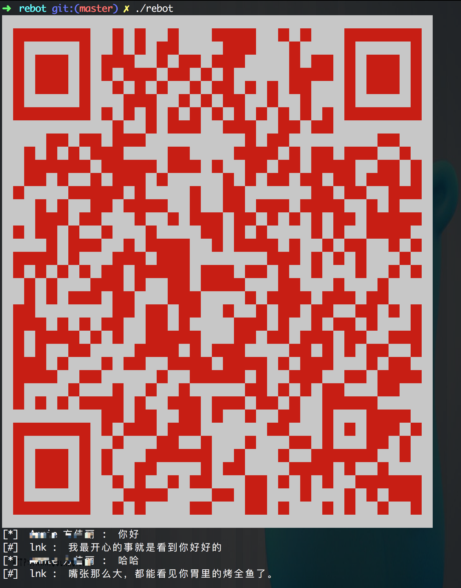

# gobot
golang 实现微信聊天机器人

## 使用

```
go get github.com/qianlnk/gobot
```

## 主要模块

- 获取UUID
- 根据UUID获取二维码
- 显示二维码
- 扫码登陆
- 初始化微信信息
- 打开状态同步通知
- 获取通讯录
- 发送信息
- 同步信息
- 获取自动回复内容

## 源码地址
[https://github.com/qianlnk/gobot](https://github.com/qianlnk/gobot)

## 网页版微信API

### 获取UUID

- 接口地址
`https://login.weixin.qq.com/jslogin?appid=wx782c26e4c19acffb&fun=new&lang=zh_CN&_={Timestamp}`

- 方法
GET

- 结果
```
window.QRLogin.code = 200; window.QRLogin.uuid = "xxx";
```

- 实现
参考GetUUID方法

### 获取二维码

- 接口地址
`https://login.weixin.qq.com/qrcode/{UUID}?t=webwx&_={Timestamp}`

- 方法
GET 

- 实现
参考GenQrcode方法

- 将二维码输出到终端
 [https://github.com/qianlnk/qrcode](https://github.com/qianlnk/qrcode)

### 登录

- 接口地址
`https://login.weixin.qq.com/cgi-bin/mmwebwx-bin/login?tip={1,0}&uuid=(UUID}&_={Timestamp}`

tip: 1 未扫码  0 已扫码

- 方法
GET

- 结果
```
window.code=xxx;

xxx:
    408 登陆超时
    201 扫描成功
    200 确认登录

当返回200时，还会有
window.redirect_uri="https://wx.qq.com/cgi-bin/mmwebwx-bin/webwxnewloginpage?ticket=xxx&uuid=xxx&lang=xxx&scan=xxx";
```

通过正则获取后面需要的URL， 后面统一用BASE_URL表示。
```
BASE_URL ＝ https://wx.qq.com
```
- 实现
参考Login方法

- 跳转
获取用户的登录信息
```
	Skey       string `xml:"skey"`
	Wxsid      string `xml:"wxsid"`
	Wxuin      string `xml:"wxuin"`
	PassTicket string `xml:"pass_ticket"`
```
### 微信初始化
- 接口地址
`BASE_URL/webwxinit?pass_ticket={PassTicket}&skey={Skey}&r={Timestamp}`

- 方法
POST
- 结果
```golang
type InitResult struct {
	BaseResponse        BaseResponse     `json:"BaseResponse"`
	Count               int              `json:"Count"`
	ContactList         []Contact        `json:"ContactList"`
	SyncKey             SyncKey          `json:"SyncKey"`
	User                User             `json:"User"`
	ChatSet             string           `json:"ChatSet"`
	SKey                string           `json:"SKey"`
	ClientVersion       int              `json:"ClientVersion"`
	SystemTime          int              `json:"SystemTime"`
	GrayScale           int              `json:"GrayScale"`
	InviteStartCount    int              `json:"InviteStartCount"`
	MPSubscribeMsgCount int              `json:"MPSubscribeMsgCount"`
	MPSubscribeMsgList  []MPSubscribeMsg `json:"MPSubscribeMsgList"`
	ClickReportInterval int              `json:"ClickReportInterval"`
}
```

- 实现
参考Init方法

### 状态通知
- 接口地址
`BASE_URL/webwxstatusnotify?lang=zh_CN&pass_ticket={PassTicket}`

- 参数
```
	params := make(map[string]interface{})
	params["BaseRequest"] = w.baseRequest
	params["Code"] = 3
	params["FromUserName"] = w.user.UserName
	params["ToUserName"] = w.user.UserName
	params["ClientMsgId"] = int(time.Now().Unix())
```

- 方法
POST

-实现
参考StatusNotify方法

### 获取通讯录
- 接口地址
`BASE_URL/webwxgetcontact?sid={Wxsid}&skey={Skey}&pass_ticket={PassTicket}`

- 参数
```
	params := make(map[string]interface{})
	params["BaseRequest"] = w.baseRequest
```

-方法
POST

- 实现
参考GetContact方法

### 同步信息
- 接口地址
`https://host/cgi-bin/mmwebwx-bin/synccheck`

host:
```
	Hosts = []string{
		"webpush.wx.qq.com",
		"webpush2.wx.qq.com",
		"webpush.wechat.com",
		"webpush1.wechat.com",
		"webpush2.wechat.com",
		"webpush1.wechatapp.com",
	}
```

-参数
```
		v := url.Values{}
		v.Add("r", w.timestamp())
		v.Add("sid", w.loginRes.Wxsid)
		v.Add("uin", w.loginRes.Wxuin)
		v.Add("skey", w.loginRes.Skey)
		v.Add("deviceid", w.deviceID)
		v.Add("synckey", w.strSyncKey())
		v.Add("_", w.timestamp())
```

- 方法
GET

- 结果
```
window.synccheck={retcode:"xxx",selector:"xxx"}

retcode:
    0 正常
    1100 手机上退出网页版微信
    1101在其他地方登录网页版微信
selector:
    0 正常
    2 新的消息
    7 进入/离开聊天界面
```

- 实现
参考SyncCheck方法

当`selector=2`时读取新的信息

- 接口地址
`BASE_URL/webwxsync?sid={Wxsid}&skey={Skey}&pass_ticket={PassTicket}`

- 参数
```
	params := make(map[string]interface{})
	params["BaseRequest"] = w.baseRequest
	params["SyncKey"] = w.syncKey
	params["rr"] = ^int(time.Now().Unix())
```
- 方法
POST

- 注意

修改synckey，重要
```
	if msg.BaseResponse.Ret == 0 {
		w.syncKey = msg.SyncKey
	}
```

- 实现
参考WxSync方法

### 发送信息
- 接口地址
`BASE_URL/webwxsendmsg?pass_ticket={PassTicket}`

- 参数
```
	params := make(map[string]interface{})
	params["BaseRequest"] = w.baseRequest
	msg := make(map[string]interface{})
	msg["Type"] = 1
	msg["Content"] = message
	msg["FromUserName"] = w.user.UserName
	msg["ToUserName"] = to
	msg["LocalID"] = clientMsgID
	msg["ClientMsgId"] = clientMsgID
	params["Msg"] = msg
```

- 方法
POST

- 实现
参考SendMessage方法

## 图灵API

获取自动回复内容

- 接口地址
`http://www.tuling123.com/openapi/api`

- 去图灵官网注册并获取key
[http://www.tuling123.com](http://www.tuling123.com)

- 参数
```
	params := make(map[string]interface{})
	params["userid"] = uid
	params["key"] = w.cfg.Tuling.Keys[w.user.NickName].Key
	params["info"] = msg
```

- 方法
POST

- 结果
```
	Code int         `json:"code"`
	Text string      `json:"text"` //100000
	URL  string      `json:"url"`  //200000
	List interface{} `json:"list"` //302000 []News 308000 []Menu
```

- 实现
参考getReply方法

## 效果图


